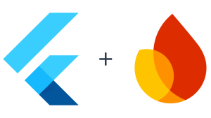

  <a href="https://firebase.google.com/docs/flutter">
     
  </a>
  <h1 align="center">FlutterFire</h1>

  
  
  

---

[[Changelog]](./CHANGELOG.md) • [[Packages]](https://pub.dev/publishers/firebase.google.com/packages)

---

FlutterFire is a set of [Flutter plugins](https://flutter.dev/platform-plugins/)
that enable Flutter apps to use [Firebase](https://firebase.google.com/) services. You can follow an example that shows
how to use these plugins in
the [Firebase for Flutter](https://firebase.google.com/codelabs/firebase-get-to-know-flutter) codelab.

[Flutter](https://flutter.dev) is Google’s UI toolkit for building beautiful, natively compiled applications for mobile,
web, and desktop from a single codebase. Flutter is used by developers and organizations around the world, and is free
and open source.

---

## Documentation

- [Add Firebase to your Flutter app](https://firebase.google.com/docs/flutter/setup)
- [Available plugins](https://firebase.google.com/docs/flutter/setup#available-plugins)
- [Firebase UI](https://github.com/firebase/FirebaseUI-Flutter) has moved to its own repository.
- [Cloud Firestore ODM](https://github.com/firebaseextended/firestoreodm-flutter) has now moved to its own repository.

---

## Stable Plugins

| Name                   | pub.dev                                                                                                                                             | Firebase Product                                                     | Documentation                                                                        | View Source                                                                                                                     | Android | iOS | Web | MacOS | Windows |
| ---------------------- | --------------------------------------------------------------------------------------------------------------------------------------------------- | -------------------------------------------------------------------- | ------------------------------------------------------------------------------------ | ------------------------------------------------------------------------------------------------------------------------------- | ------- | --- | --- | ----- | ------- |
| Analytics              |                       | [🔗](https://firebase.google.com/products/analytics)                 | [📖](https://firebase.google.com/docs/analytics/get-started?platform=flutter)        | [`firebase_analytics`](https://github.com/FirebaseExtended/flutterfire/tree/main/packages/firebase_analytics)                 | ✔       | ✔   | ✔   | β     | N/A     |
| App Check              |                       | [🔗](https://firebase.google.com/docs/app-check)                     | [📖](https://firebase.google.com/docs/app-check/flutter/default-providers)           | [`firebase_app_check`](https://github.com/FirebaseExtended/flutterfire/tree/main/packages/firebase_app_check)                 | ✔       | ✔   | ✔   | β     | N/A     |
| Authentication         |                            | [🔗](https://firebase.google.com/products/auth)                      | [📖](https://firebase.google.com/docs/auth/flutter/start)                            | [`firebase_auth`](https://github.com/FirebaseExtended/flutterfire/tree/main/packages/firebase_auth)                           | ✔       | ✔   | ✔   | β     | (*)     |
| Cloud Firestore        |                       | [🔗](https://firebase.google.com/products/firestore)                 | [📖](https://firebase.google.com/docs/firestore/quickstart)                          | [`cloud_firestore`](https://github.com/FirebaseExtended/flutterfire/tree/main/packages/cloud_firestore)                       | ✔       | ✔   | ✔   | β     | (*)     |
| Cloud Functions        |                       | [🔗](https://firebase.google.com/products/functions)                 | [📖](https://firebase.google.com/docs/functions/get-started?gen=2nd)                 | [`cloud_functions`](https://github.com/FirebaseExtended/flutterfire/tree/main/packages/cloud_functions)                       | ✔       | ✔   | ✔   | β     | N/A     |
| Cloud Messaging        |                 | [🔗](https://firebase.google.com/products/cloud-messaging)           | [📖](https://firebase.google.com/docs/cloud-messaging/flutter/client)                | [`firebase_messaging`](https://github.com/FirebaseExtended/flutterfire/tree/main/packages/firebase_messaging)                 | ✔       | ✔   | ✔   | β     | N/A     |
| Cloud Storage          |                       | [🔗](https://firebase.google.com/products/storage)                   | [📖](https://firebase.google.com/docs/storage/flutter/start)                         | [`firebase_storage`](https://github.com/FirebaseExtended/flutterfire/tree/main/packages/firebase_storage)                     | ✔       | ✔   | ✔   | β     | (*)     |
| Core                   |                                      | [🔗](https://firebase.google.com)                                    | [📖](https://firebase.google.com)                                                    | [`firebase_core`](https://github.com/FirebaseExtended/flutterfire/tree/main/packages/firebase_core)                           | ✔       | ✔   | ✔   | β     | (*)     |
| Crashlytics            |                 | [🔗](https://firebase.google.com/products/crashlytics)               | [📖](https://firebase.google.com/docs/crashlytics/get-started?platform=flutter)      | [`firebase_crashlytics`](https://github.com/FirebaseExtended/flutterfire/tree/main/packages/firebase_crashlytics)             | ✔       | ✔   | N/A | β     | N/A     |
| Data Connect           |             | [🔗](https://firebase.google.com/products/data-connect)              | [📖](https://firebase.google.com/docs/data-connect/quickstart-local?userflow=automatic#flutter) | [`firebase_data_connect`](https://github.com/FirebaseExtended/flutterfire/tree/main/packages/firebase_data_connect) | ✔       | ✔   | ✔   | N/A   | N/A     |
| In-App Messaging       |  | [🔗](https://firebase.google.com/products/in-app-messaging)          | [📖](https://firebase.google.com/docs/in-app-messaging/get-started?platform=flutter) | [`firebase_in_app_messaging`](https://github.com/FirebaseExtended/flutterfire/tree/main/packages/firebase_in_app_messaging)   | ✔       | ✔   | N/A | N/A   | N/A     |
| Installations          |   | [🔗](https://firebase.google.com/docs/projects/manage-installations) | [📖](https://firebase.google.com/docs/projects/manage-installations#flutter)         | [`firebase_app_installations`](https://github.com/FirebaseExtended/flutterfire/tree/main/packages/firebase_app_installations) | ✔       | ✔   | ✔   | β     | N/A     |
| Performance Monitoring |      | [🔗](https://firebase.google.com/products/performance)               | [📖](https://firebase.google.com/docs/perf-mon/flutter/get-started)                  | [`firebase_performance`](https://github.com/FirebaseExtended/flutterfire/tree/main/packages/firebase_performance)             | ✔       | ✔   | ✔   | N/A   | N/A     |
| Realtime Database      |                 | [🔗](https://firebase.google.com/products/database)                  | [📖](https://firebase.google.com/docs/database/flutter/start)                        | [`firebase_database`](https://github.com/FirebaseExtended/flutterfire/tree/main/packages/firebase_database)                   | ✔       | ✔   | ✔   | β     | N/A     |
| Remote Config          |           | [🔗](https://firebase.google.com/products/remote-config)             | [📖](https://firebase.google.com/docs/remote-config/get-started?platform=flutter)    | [`firebase_remote_config`](https://github.com/FirebaseExtended/flutterfire/tree/main/packages/firebase_remote_config)         | ✔       | ✔   | ✔   | β     | N/A     |

 (*) for development only. Production on Windows is not supported.

## Preview Plugins

| Name                | pub.dev                                                                                                                                                      | Firebase Product                                                                                                                                      | Documentation                                                        | View Source                                                                                                                         | Android | iOS | Web | MacOS |
|---------------------|:--------------------------------------------------------------------------------------------------------------------------------------------------------------:|:-------------------------------------------------------------------------------------------------------------------------------------------------------:|:----------------------------------------------------------------------:|:-------------------------------------------------------------------------------------------------------------------------------------:|:---------:|:-----:|:-----:|:-------:|
| ML Model Downloader |  | [🔗](https://firebase.google.com/products/ml) | [📖](https://firebase.google.com/docs/ml/flutter/use-custom-models) | [`firebase_ml_model_downloader`](https://github.com/FirebaseExtended/flutterfire/tree/main/packages/firebase_ml_model_downloader) | ✔       | ✔   | N/A | β     |

## Issues

Please file FlutterFire specific issues, bugs, or feature requests in
our [issue tracker](https://github.com/firebase/flutterfire/issues/new/choose).

Plugin issues that are not specific to FlutterFire can be filed in
the [Flutter issue tracker](https://github.com/flutter/flutter/issues/new).

## Contributing

If you wish to contribute a change to any of the existing plugins in this repo, please review
our [contribution guide](https://github.com/firebase/flutterfire/blob/main/CONTRIBUTING.md)
and open a [pull request](https://github.com/firebase/flutterfire/pulls).
