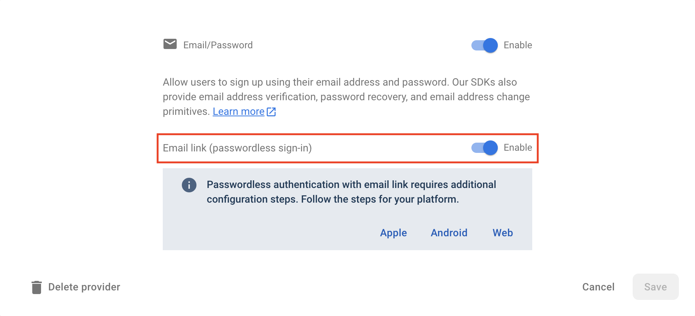

# Firebase UI Email Link provider

## Configuration

To support Email link as a provider, first ensure that the "Email link" is enabled under "Email/Password" provider
in the [Firebase Console](https://console.firebase.google.com/project/_/authentication/providers):



Configure email provider:

```dart
import 'package:firebase_core/firebase_core.dart';
import 'package:firebase_ui_auth/firebase_ui_auth.dart';

import 'firebase_options.dart';

void main() {
  WidgetsFlutterBinding.ensureInitialized();
  await Firebase.initializeApp(options: DefaultFirebaseOptions.currentPlatform);

  FirebaseUIAuth.configureProviders([
    EmailLinkAuthProvider(
      actionCodeSettings: ActionCodeSettings(
        url: 'https://<your-project-id>.page.link',
        handleCodeInApp: true,
        androidMinimumVersion: '1',
        androidPackageName:
            'io.flutter.plugins.firebase_ui.firebase_ui_example',
        iOSBundleId: 'io.flutter.plugins.flutterfireui.flutterfireUIExample',
      ),
    ),
    // ... other providers
  ]);
}
```

See [this doc](https://firebase.google.com/docs/auth/flutter/email-link-auth) for more info about `ActionCodeSettings`.

## Using screen

After adding `EmailLinkAuthProvider` to the `FirebaseUIAuth.configureProviders`, `SignInScreen` or `RegisterScreen` will have a button that will trigger `EmailLinkSignInAction`, or, if no action provided, will open `EmailLinkSignInScreen` using `Navigator.push`.

```dart
MaterialApp(
  initialRoute: '/login',
  routes: {
    '/login': (context) {
      return SignInScreen(
        actions: [
          EmailLinkSignInAction((context) {
            Navigator.pushReplacementNamed(context, '/email-link-sign-in');
          }),
        ],
      );
    },
    '/email-link-sign-in': (context) => EmailLinkSignInScreen(
      actions: [
        AuthStateChangeAction<SignedIn>((context, state) {
          Navigator.pushReplacementNamed(context, '/profile');
        }),
      ],
    ),
    '/profile': (context) => ProfileScreen(),
  }
)
```

> Notes:
>
> - see [navigation guide](../navigation.md) to learn how navigation works with Firebase UI.
> - explore [FirebaseUIActions API docs](https://pub.dev/documentation/firebase_ui_auth/latest/firebase_ui_auth/FirebaseUIAction-class.html).

## Using view

If the pre-built screen don't suit the app's needs, you could use a `EmailLinkSignInView` to build your custom screen:

```dart
class MyEmailLinkSignInScreen extends StatelessWidget {
  @override
  Widget build(BuildContext) {
    return Scaffold(
      body: Column(
        children: [
          MyCustomHeader(),
          Expanded(
            child: Padding(
            padding: const EdgeInsets.all(16),
              child: FirebaseUIActions(
                actions: [
                  AuthStateChangeAction<SignedIn>((context, state) {
                    Navigator.pushReplacementNamed(context, '/profile');
                  }
                ],
                child: EmailLinkSignInView(provider: emailLinkAuthProvider),
              ),
            ),
          ),
        ]
      )
    )
  }
}
```

## Building a custom widget with `AuthFlowBuilder`

You could also use `AuthFlowBuilder` to facilitate the functionality of the `EmailLinkFlow`:

```dart
class MyCustomWidget extends StatelessWidget {
  @override
  Widget build(BuildContext context) {
    return AuthFlowBuilder<EmailLinkAuthController>(
      provider: emailLinkProvider,
      listener: (oldState, newState, ctrl) {
        if (newState is SignedIn) {
          Navigator.of(context).pushReplacementNamed('/profile');
        }
      }
      builder: (context, state, ctrl, child) {
        if (state is Uninitialized) {
          return TextField(
            decoration: InputDecoration(label: Text('Email')),
            onSubmitted: (email) {
              ctrl.sendLink(email);
            },
          );
        } else if (state is AwaitingDynamicLink) {
          return CircularProgressIndicator();
        } else if (state is AuthFailed) {
          return ErrorText(exception: state.exception);
        } else {
          return Text('Unknown state $state');
        }
      },
    );
  }
}
```

## Building a custom stateful widget

For full control over every phase of the authentication lifecycle you could build a stateful widget, which implements `EmailLinkAuthListener`:

```dart
class CustomEmailLinkSignIn extends StatefulWidget {
  const CustomEmailLinkSignIn({Key? key}) : super(key: key);

  @override
  State<CustomEmailLinkSignIn> createState() => _CustomEmailLinkSignInState();
}

class _CustomEmailLinkSignInState extends State<CustomEmailLinkSignIn>
    implements EmailLinkAuthListener {
  final auth = FirebaseAuth.instance;
  late final EmailLinkAuthProvider provider =
      EmailLinkAuthProvider(actionCodeSettings: actionCodeSettings)
        ..authListener = this;

  late Widget child = TextField(
    decoration: const InputDecoration(
      labelText: 'Email',
    ),
    onSubmitted: provider.sendLink,
  );

  @override
  void onBeforeLinkSent(String email) {
    setState(() {
      child = CircularProgressIndicator();
    });
  }

  @override
  void onLinkSent(String email) {
    setState(() {
      child = Text('Check your email and click the link');
    });
  }

  @override
  Widget build(BuildContext context) {
    return Center(child: child);
  }

  @override
  void onBeforeCredentialLinked(AuthCredential credential) {
    setState(() {
      child = CircularProgressIndicator();
    });
  }

  @override
  void onBeforeProvidersForEmailFetch() {
    setState(() {
      child = CircularProgressIndicator();
    });
  }

  @override
  void onBeforeSignIn() {
    setState(() {
      child = CircularProgressIndicator();
    });
  }

  @override
  void onCanceled() {
    setState(() {
      child = Text('Authenticated cancelled');
    });
  }

  @override
  void onCredentialLinked(AuthCredential credential) {
    Navigator.of(context).pushReplacementNamed('/profile');
  }

  @override
  void onDifferentProvidersFound(
      String email, List<String> providers, AuthCredential? credential) {
    showDifferentMethodSignInDialog(
      context: context,
      availableProviders: providers,
      providers: FirebaseUIAuth.providersFor(FirebaseAuth.instance.app),
    );
  }

  @override
  void onError(Object error) {
    try {
      // tries default recovery strategy
      defaultOnAuthError(provider, error);
    } catch (err) {
      setState(() {
        defaultOnAuthError(provider, error);
      });
    }
  }

  @override
  void onSignedIn(UserCredential credential) {
    Navigator.of(context).pushReplacementNamed('/profile');
  }
}
```

## Other topics

- [EmailAuthProvider](./email.md) - allows registering and signing using email and password.
- [Email verification](./email-verification.md)
- [PhoneAuthProvider](./phone.md) - allows registering and signing using a phone number
- [UniversalEmailSignInProvider](./universal-email-sign-in.md) - gets all connected auth providers for a given email.
- [OAuth](./oauth.md)
- [Localization](../../../firebase_ui_localizations/README.md)
- [Theming](../theming.md)
- [Navigation](../navigation.md)
