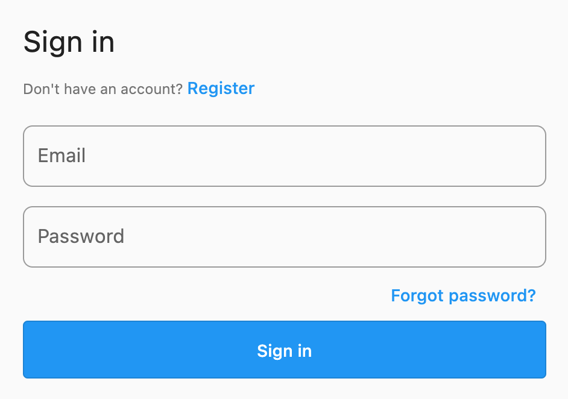

# Theming

Firebase UI widgets are built on top of Material and Cupertino design patterns provided by Flutter.

To provide consistency across your application, the Firebase UI widgets depend on the [`ThemeData`](https://api.flutter.dev/flutter/material/ThemeData-class.html)
or [`CupertinoThemeData`](https://api.flutter.dev/flutter/cupertino/CupertinoThemeData-class.html) instances provided to your `MaterialApp` or `CupertinoApp` widget.

For example, the `SignInScreen` widget with an email provider wrapped in a `MaterialApp` will use the following widgets:

- [`TextFormField`](https://api.flutter.dev/flutter/material/TextFormField-class.html)
- [`TextButton`](https://api.flutter.dev/flutter/material/TextButton-class.html)
- [`OutlinedButton`](https://api.flutter.dev/flutter/material/OutlinedButton-class.html)

```dart
class FirebaseAuthUIExample extends StatelessWidget {
  @override
  Widget build(BuildContext context) {
    return const MaterialApp(
      home: SignInScreen(
        providers: [
          EmailAuthProvider(),
        ],
      ),
    );
  }
}
```

This will render a screen with the default Material style widgets:


To update these styles, we can override the `ThemeData` provided to the `MaterialApp`. For example, to apply a border to the input fields,
we can override the `InputDecorationTheme`:

```dart
class FirebaseAuthUIExample extends StatelessWidget {
  @override
  Widget build(BuildContext context) {
    return MaterialApp(
      theme: ThemeData(
        inputDecorationTheme: InputDecorationTheme(
          border: OutlineInputBorder(
            borderRadius: BorderRadius.circular(8),
          ),
        ),
      ),
      home: const SignInScreen(
        providers: [
          EmailAuthProvider(),
        ],
      ),
    );
  }
}
```

The UI widgets will respect the updated theme data, and the UI will be reflected to match:


Furthermore, we can customize the button used in the UI by overriding the `OutlinedButtonThemeData`:

```dart
class FirebaseAuthUIExample extends StatelessWidget {
  @override
  Widget build(BuildContext context) {
    return MaterialApp(
      theme: ThemeData(
        inputDecorationTheme: InputDecorationTheme(
          border: OutlineInputBorder(
            borderRadius: BorderRadius.circular(8),
          ),
        ),
        outlinedButtonTheme: OutlinedButtonThemeData(
          style: ButtonStyle(
            padding: MaterialStateProperty.all<EdgeInsets>(
              const EdgeInsets.all(24),
            ),
            backgroundColor: MaterialStateProperty.all<Color>(Colors.blue),
            foregroundColor: MaterialStateProperty.all<Color>(Colors.white),
          ),
        ),
      ),
      home: const SignInScreen(
        providers: [
          EmailAuthProvider(),
        ],
      ),
    );
  }
}
```

The button will now respect the updated theme data and display a styled button instead:



## Other topics

- [EmaiAuthProvider](./providers/email.md) - allows registering and signing using email and password.
- [EmailLinkAuthProvider](./providers/email-link.md) - allows registering and signing using a link sent to email.
- [PhoneAuthProvider](./providers/phone.md) - allows registering and signing using a phone number
- [UniversalEmailSignInProvider](./providers/universal-email-sign-in.md) - gets all connected auth providers for a given email.
- [OAuth](./providers/oauth.md)

- [Localization](../../firebase_ui_localizations/README.md)
- [Navigation](./navigation.md)
