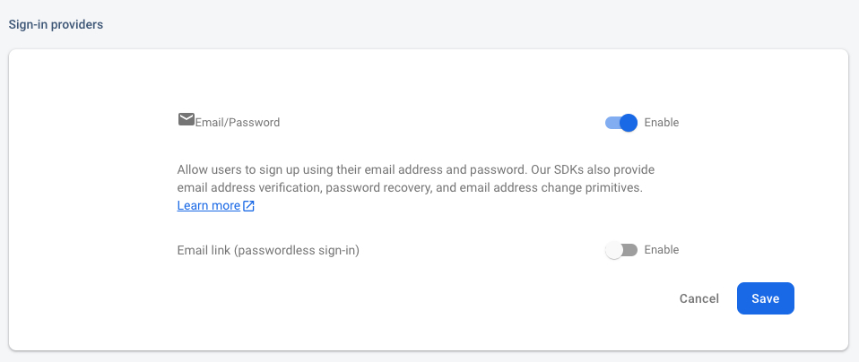
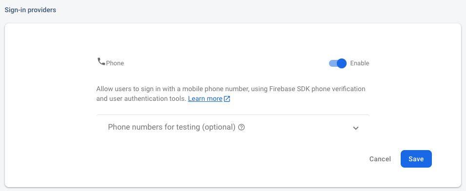
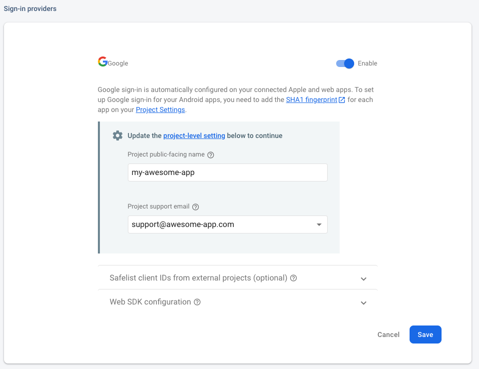
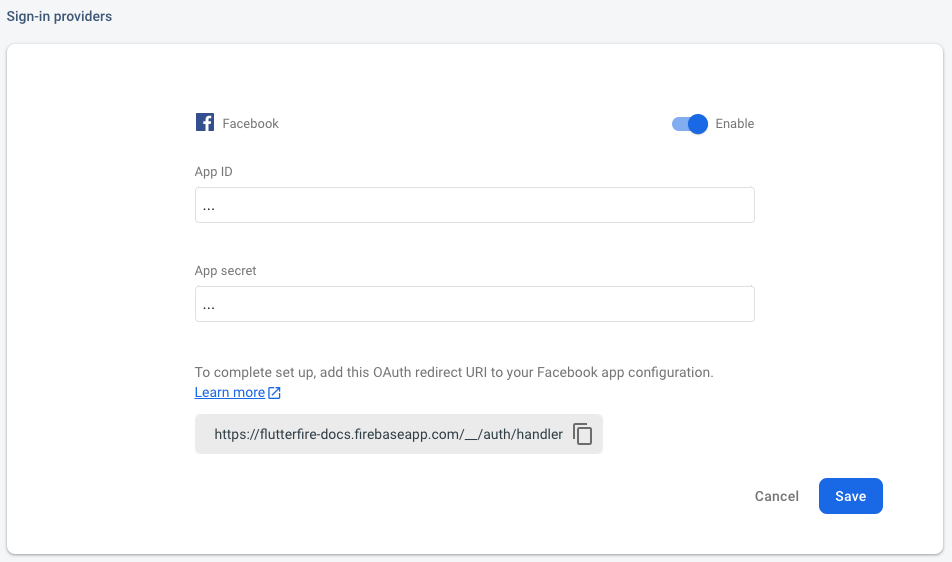
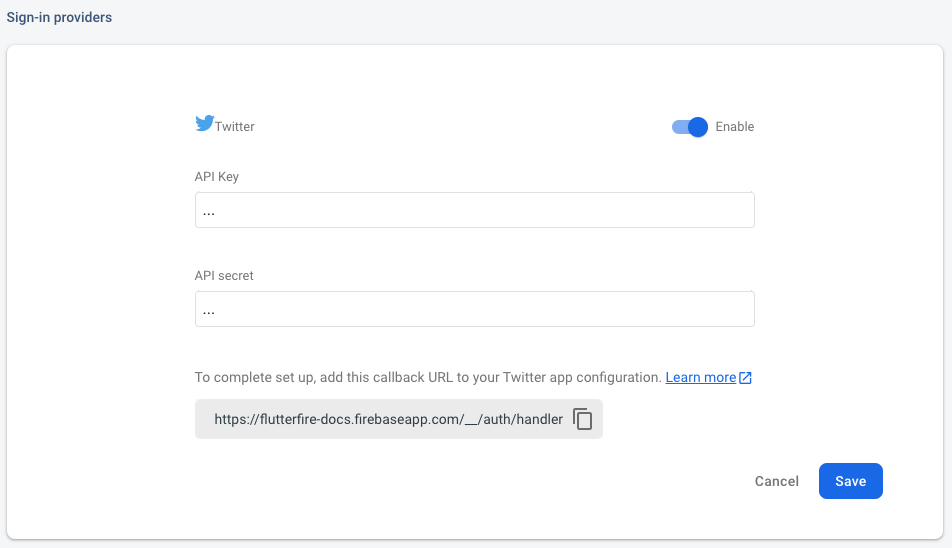

# Providers

A "Provider" is a type of authentication method which users can use to perform authentication
operations against, for example to sign-in, register or link an account.

When using UI widgets, you can add a provider to the `providerConfigs` list of a widget to render the appropriate UI for that provider - for example, an Email Provider will render inputs and a
button, whilst the Google Provider will render a themed "Sign In with Google" button.

FlutterFire UI for Auth currently supports the following providers:

- [Email/Password](#email)
- [Email link](#email-link)
- [Phone Number](#phone-number)
- [Google](#google)
- [Facebook](#facebook)
- [Twitter](#twitter)
- [Apple](#apple)

## Email Provider

To support Email Addresses as a provider, first ensure that the "Email/Password" provider is
enabled in the [Firebase Console](https://console.firebase.google.com/project/_/authentication/providers):



On any UI widget which supports providers, you can now provide an instance of a `EmailProviderConfiguration` to the
`providerConfigs` list, for example:

```dart
RegisterScreen(
  providerConfigs: [
    EmailProviderConfiguration()
  ],
)
```

The registration screen will now render a form with a text input for the email address and a password input, along with
an action button to trigger the registration process.

## Email Link

To support Email link as a provider, first ensure that the "Email link" is enabled under "Email/Password" provider
in the [Firebase Console](https://console.firebase.google.com/project/_/authentication/providers):


On any UI widget which supports providers, you can now provide an instance of a `EmailLinkProviderConfiguration` to the
`providerConfigs` list, for example:

```dart
RegisterScreen(
  providerConfigs: [
    EmailLinkProviderConfiguration(
      actionCodeSettings: ActionCodeSettings(
        url: 'example.com',
        handleCodeInApp: true,
        androidMinimumVersion: '12',
        androidPackageName: 'com.bundle.id',
        iOSBundleId: 'com.bundle.id',
      ),
    ),
  ],
)
```

> Email link providers are only available on iOS and Android.

## Phone Number

To support Phone Numbers as a provider, first ensure that the "Phone" provider is
enabled in the [Firebase Console](https://console.firebase.google.com/project/_/authentication/providers):



Next, follow the [Setup Instructions](https://firebase.google.com/docs/auth/flutter/phone-auth) to configure Phone Authentication for your
platforms.

Once complete, add a `PhoneProviderConfiguration` instance to the `providerConfigs` list of a supporting UI widget, for example:

```dart
RegisterScreen(
  providerConfigs: [
    PhoneProviderConfiguration()
  ],
)
```

The registration screen will now render a button which, when pressed, will trigger the phone number verification process.

## Google

To support Google as a provider, first install the official [`google_sign_in`](https://pub.dev/packages/google_sign_in)
plugin to your project as described in the README.

Next, enable the "Google" provider in the Firebase Console:



> To ensure cross-platform support, please ensure you have followed installation instructions for both the `google_sign_in` package and the provider on the Firebase Console (such as adding a [SHA1 fingerprint](https://developers.google.com/android/guides/client-auth?authuser=0) for Android applications).

Once installed, add a `GoogleProviderConfiguration` instance to the `providerConfigs` list of a supporting UI widget, for example:

```dart
RegisterScreen(
  providerConfigs: [
    GoogleProviderConfiguration(
      clientId: '...',
    )
  ],
)
```

A themed Google OAuth button will now be rendered, and when pressed will trigger the authentication flow for Google.
The configuration requires the `clientId` property (which can be found in the Firebase Console) to be set for seamless cross-platform support.


## Facebook

To support Facebook as a provider, first install the [`flutter_facebook_auth`](https://pub.dev/packages/flutter_facebook_auth)
plugin to your project. Each platform requires that you follow the [installation process](https://facebook.meedu.app) as specified
in the documentation.

Next, enable the "Facebook" provider in the Firebase Console & provide your created Facebook App ID and secret:



Once installed, add a `FacebookProviderConfiguration` instance to the `providerConfigs` list of a supporting UI widget, for example:

```dart
RegisterScreen(
  providerConfigs: [
    FacebookProviderConfiguration(
      clientId: '...',
    )
  ],
)
```

A themed Facebook OAuth button will now be rendered, and when pressed will trigger the authentication flow for Facebook.
The configuration requires the `clientId` property (which can be found in the Firebase Console) to be set for seamless cross-platform support.


## Twitter

To support Twitter as a provider, first install the [`twitter_login`](https://pub.dev/packages/twitter_login)
plugin to your project.

Next, enable the "Twitter" provider in the Firebase Console:



Once installed, add a `TwitterProviderConfiguration` instance to the `providerConfigs` list of a supporting UI widget, for example:

```dart
RegisterScreen(
  providerConfigs: [
    TwitterProviderConfiguration(
      apiKey: '...',
      apiSecretKey: '...',
      redirectUri: '<your-scheme>://'
    )
  ],
)
```

A themed Twitter OAuth button will now be rendered, and when pressed will trigger the authentication flow for Twitter.

You can get the `apiKey` and `apiSecretKey` from the Firebase Console or [twitter developer portal](https://developer.twitter.com/en/portal/projects-and-apps).


Providing the `apiSecretKey` directly is not advised if you are building for the web. Instead, you can use "dart-define" to ensure that the value is omitted from web builds:

```bash
flutter run --dart-define TWITTER_SECRET=<your-twitter-api-secret-key>
```

When building the app on platforms other than the web, the `TWITTER_SECRET` environment variable can be defined using:

```dart
apiSecretKey: String.fromEnvironment('TWITTER_SECRET', ''),
```

## Apple

To support Apple as a provider, first install the [`sign_in_with_apple`](https://pub.dev/packages/sign_in_with_apple)
plugin to your project. Once added, follow the [Integration](https://pub.dev/packages/sign_in_with_apple#integration) steps
for each platform.

Next, enable the "Apple" provider in the Firebase Console:


Once installed, add an `AppleProviderConfiguration` instance to the `providerConfigs` list of a supporting UI widget, for example:

```dart
RegisterScreen(
  providerConfigs: [
    AppleProviderConfiguration(),
  ],
)
```

A themed Apple OAuth button will now be rendered, and when pressed will trigger the authentication flow for Apple.

<!-- The `clientId` property can be obtained from the [Apple Developer Portal](https://developer.apple.com/account/resources/identifiers/list/serviceId) - see
[the documentation](https://pub.dev/documentation/sign_in_with_apple/latest/sign_in_with_apple/WebAuthenticationOptions/clientId.html) for more information. -->
